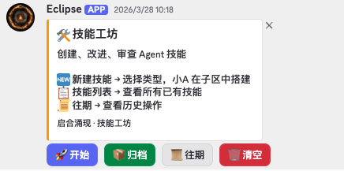
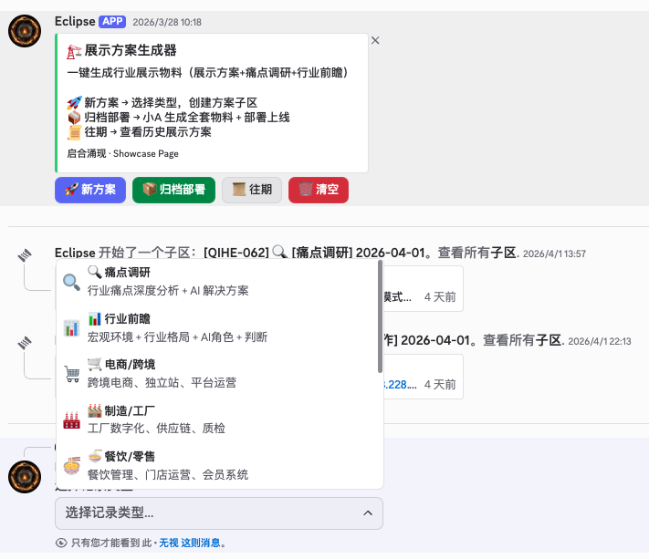
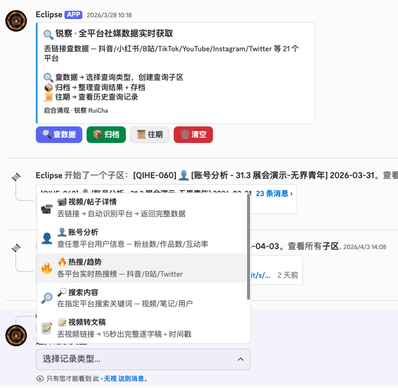
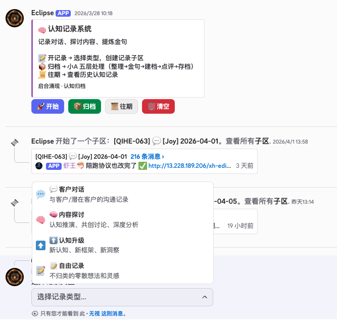

<div align="center">

# Asyre Eclipse Bot

> *"AI doesn't degrade because it's stupid. It degrades because you gave it 500 messages of context and expected it to remember message 3."*


<br>

**Your AI agent gave you a perfect answer on message 1. What about message 50?**

**You started a new chat to fix it. Now where did that design discussion go?**

**Your team uses 5 different AI tools. None of them talk to each other.**

<br>

### Config-driven Discord AI workspace.<br>Isolated threads. Injected skill context. Human-controlled lifecycle.

<br>

**[中文文档 (Chinese)](README_CN.md)**

[**Why This Exists**](#why-this-exists) · [**How It Works**](#how-it-actually-works) · [**Templates**](#the-6-templates) · [**Quick Start**](#quick-start) · [**Configuration**](#configuration-reference)

</div>

<br>

---

## Why This Exists

If you have used AI agents for any meaningful period of time, you have experienced the degradation problem. You start a conversation, the AI is sharp, follows instructions perfectly, produces exactly what you want. Then you ask it to do something else in the same chat. Then something else. By message 30, it is confused. By message 50, it is hallucinating — referencing things you never said, mixing up tasks, forgetting constraints you set 20 messages ago.

This is not a bug. This is how large language models work. They have a context window — a fixed amount of text they can "see" at any given time. Every message you send pushes older messages further away. The AI does not truly "remember" — it re-reads the visible conversation each time. When the conversation gets long enough, critical instructions fall out of view, and the AI starts filling gaps with plausible-sounding fabrications.

Most teams deal with this by starting new chats manually. But that creates a different problem: scattered context. Your design discussion is in one chat, the follow-up is in another, the final version is in a third, and nobody can find anything. There is no structure, no lifecycle, no way to say "this task started here and ended here."

Eclipse Bot exists to solve both problems at once.

### The Core Insight: Context Isolation + Skill Injection

The fundamental idea is simple but powerful:

**Every AI task gets its own isolated thread, and every thread starts with the right skill context injected automatically.**

When a user clicks "Open" on a writing panel, Eclipse Bot does not just create an empty thread. It creates a thread and immediately posts a structured context message that tells the AI:

- What skill this is (e.g., "deep content writing")
- What type of task the user selected (e.g., "opinion piece")
- What the AI should do (the full skill definition — process, quality criteria, output format)
- What constraints apply

The AI enters the conversation with clear, fresh instructions. It does not need to guess what it should be doing. It does not carry baggage from previous conversations. It reads the injected context, waits for the user's input, and executes the skill.

When the task is done, the user clicks "Archive." The AI processes the output (summarizes, saves files, publishes — whatever the skill defines), and the thread is closed. Clean start, clean end.

This is not a theoretical improvement. We have run this system in production across 4 Discord communities with 80+ active skill panels. The difference in AI output quality between a scoped thread with injected context versus an unstructured chat conversation is dramatic.

### Why Discord?

**1. Teams already live there.** For communities, creative teams, small companies, and especially teams working with AI agents — Discord is already the daily workspace. Zero adoption friction.

**2. Threads are the perfect AI task container.** Naturally isolated, auto-archivable, searchable, nested under parent channels. Rich media support. Built-in member management. Exactly what an AI task needs.

**3. The bot ecosystem is mature.** Discord.js is battle-tested. Bots can manage channels, permissions, threads, and messages programmatically. An entire AI workspace deployed with one command.

---

## How It Actually Works

### The Skill Panel System

A Skill Panel is a permanent message (embed + buttons) in a Discord channel. Each channel is dedicated to one type of work.


```
Channel: #deep-writing
+------------------------------------------+
|  ✍️ Deep Writing System                  |
|                                          |
|  Select a content type to start a new    |
|  writing task. AI joins with full skill  |
|  context injected.                       |
|                                          |
|  [✍️ Open] [📦 Archive] [📜 History] [🗑️ Clean] |
+------------------------------------------+
```

<div align="center">

<br><em>Skill Forge panel. Title: "Skill Workshop — Create, improve, and audit Agent skills." Three workflows: create new skill, view skill list, view history. Buttons: Start, Archive, History, Clean.</em>
</div>

**Open** — User clicks, selects task type. Eclipse Bot:
1. Creates a thread with unique ID (e.g., `ASYR-042`)
2. Adds AI bot + team members
3. Posts skill context (what the AI should do, quality criteria, output format)
4. AI receives a message like:

```
Task context:
- Skill: content-writing
- Type: Opinion Piece
- Description: Express a strong viewpoint — persuasion + value guidance

Read the skill docs and prepare for Opinion Piece work.
```

The AI knows exactly what to do before the user even speaks. No guessing. No hallucinations from mixed context.


**Archive** — AI processes the thread output (summarizes, saves files, publishes). Thread marked complete.

**History** — Query past completed tasks.

**Clean** — Remove non-panel messages from channel.

### Why One Channel = One Skill

When each channel serves one skill, the workspace becomes self-documenting:

```
Instead of:
  #general-ai-chat (500 messages, AI confused, nobody knows what's done)

You get:
  #deep-writing     -> ASYR-001 Article about AI agents (archived, done)
                    -> ASYR-002 Weekly newsletter (in progress)
  #design-studio    -> DSGN-001 Landing page mockup (archived, done)
  #client-quotes    -> QUOT-001 Manufacturing client (in progress)
```

Every task traceable. Every AI interaction scoped. Archive ensures nothing lost.

<div align="center">

<br><em>Showcase Page Generator in action. Panel: "One-click industry showcase materials." Below: thread QIHE-062 created for "Pain Point Research." Type selector: Pain Point Research (depth analysis + AI solutions), Industry Foresight (macro + landscape + AI), E-commerce/Cross-border, Manufacturing/Factory, F&B/Retail.</em>
</div>


<div align="center">

<br><em>Thread created for "Cognitive Upgrade" task. Top: Eclipse Bot mentions team members and posts a welcome embed with date, participants, and instructions. Bottom: AI bot receives injected context — skill name (<code>cognitive-archive</code>), type (Cognitive Upgrade), description, and instruction to read the skill docs and wait for user input.</em>
</div>


### The Lifecycle Model

```
[Idle] --> User clicks Open --> [Active Thread]
                                     |
                              User works with AI
                                     |
                              User clicks Archive --> [Processed & Closed]
                                                           |
                                                    AI saves output
                                                    Thread archived
                                                           |
                                                      [Done] --> searchable, traceable
```

Without this: threads pile up, no clear status, stale AI context, cluttered workspace.

With this: clear beginning and end, forced final deliverable, clean workspace, full auditability.

<div align="center">

<br><em>RuiCha social media data panel — real-time data from 21 platforms (Douyin, Xiaohongshu, Bilibili, TikTok, YouTube, Instagram, Twitter). Types: Video/Post Details, Account Analysis, Trending/Hot Topics, Content Search, Video Transcript. Thread QIHE-060 created for "Account Analysis" with 23 messages.</em>
</div>


<div align="center">

<br><em>Archive in action. Top: Eclipse Bot sends archive command — "Read all thread messages, generate structured summary (topics, decisions, action items), save to server." Bottom: AI bot responds with completion — summary saved to <code>hq/daily-sync/2026-03-15.md</code>, containing 9 topics, 8 decisions, 6 action items, 6 deliverables, with key decisions listed (e.g., "GOG CLI defaults to Google tools", "AI email marketing direction", "SEO strategy 8000-word full document").</em>
</div>


---

## The 6 Templates

> Extracted from real production deployments running daily across 4 Discord communities. Not theoretical designs.

### 1. Content Creator — 4 panels

| Panel | Types | What It Does |
|-------|-------|-------------|
| **Deep Writing** | 7 (commentary, explainer, opinion, tutorial, emotional, investigative, free) | Full 7-phase writing pipeline with quality assessment |
| **Social Layout** | 5 (article, single-page, illustrated, long-form, branded) | Markdown to 1080x1440 social media cards |
| **AI Illustration** | 7 (infographic, scene, flowchart, comparison, framework, timeline, mixed) | Article illustration via type x style matrix |
| **Knowledge Archive** | 4 (client chat, discussion, cognitive upgrade, free note) | Conversation recording, quote extraction, person profiling |

**Best for**: Writers, KOLs, content teams, anyone producing written content regularly.

<div align="center">

<br><em>Cognitive Archive in production — panel + active threads (QIHE-063 "Joy" with 216 messages) + type selector (Client Conversation, Content Discussion, Cognitive Upgrade, Free Notes). AI confirms completion with output file link.</em>
</div>


### 2. Service Agency — 6 panels

| Panel | Types | What It Does |
|-------|-------|-------------|
| **Client Quotes** | 8 (construction, F&B, manufacturing, e-commerce, education, travel, healthcare, custom) | Industry-templated professional quotes |
| **Client Follow-up** | 6 (price anxiety, risk fear, unclear value, decision delay, scope drift, routine) | Diagnostic-based selling (DBS) follow-up strategies |
| **Showcase Pages** | 10 (pain-point research, foresight, + 8 industry templates) | Landing page and showcase generation |
| **Design Workspace** | 6 (layout, UI, branding, poster, video, other) | General design workbench |
| **WeChat Publishing** | 2 (push article, account management) | WeChat Official Account management |
| **Content Cards** | 6 (long-form, infographic, multi-card, visual notes, comics, whiteboard) | Content to visual card conversion |

**Best for**: Design firms, consulting companies, outsourcing teams.


### 3. Creative Studio — 7 panels

| Panel | Types | What It Does |
|-------|-------|-------------|
| **Announcements** | 4 | Structured community announcements |
| **Art Studio** | 3 | AI image generation, editing, style transfer |
| **Writing Hall** | 3 | Poetry, prose, fiction |
| **Music Room** | 2 | Voice synthesis (TTS), audio production |
| **Video Dept** | 2 | Scriptwriting, post-production guidance |
| **Theater** | 3 | Playwriting, direction, critique |
| **Lecture Hall** | 3 | Open lectures, seminars, reading groups |

**Best for**: Art teams, creative communities, interest groups.

### 4. Full Business — 31 panels

All auto-mode (no predefined types — AI infers from channel context).

| Department | Panels | Coverage |
|-----------|--------|----------|
| **Strategy** | 3 | Brand & planning, decisions & data, knowledge & training |
| **Marketing** | 6 | Copywriting, social media, advertising, customer profiling, marketing docs, design |
| **Sales** | 4 | Client management, channels, quotes & contracts, scheduling |
| **Operations** | 5 | Procurement, production, sampling, warehouse & logistics, approvals |
| **Finance** | 6 | Financial docs, invoicing, tax, bookkeeping, cost analysis, credentials |
| **Admin** | 7 | HR, KPI, admin docs, registration, contracts, assets, legal & IP |

**Best for**: SMEs wanting to digitize every function. Each department head gets AI-powered channels.

### 5. Knowledge Hub — 5 panels

| Panel | Types | What It Does |
|-------|-------|-------------|
| **KB Ingestion** | 5 (web, YouTube, Twitter, PDF, manual) | Extract, summarize, structure knowledge |
| **Knowledge Forge** | 5 (article, audio, video, book, free) | Raw knowledge to structured modules |
| **Thinking Tools** | 8 (roundtable, writing engine, rank-reduction, concept anatomy, investment, plain-language, paper reader, travel research) | Cognitive framework toolkit |
| **Workspace Tidy** | 2 (full scan, lifecycle cleanup) | File system maintenance |
| **Console** | 3 (deploy, refresh, audit) | Panel management meta-panel |

**Best for**: Research teams, training organizations, companies building internal knowledge bases.

### 6. Lifestyle Community — 8 panels

| Panel | Types | What It Does |
|-------|-------|-------------|
| **Wellness** | 3 | Health plans, dietary therapy, exercise routines |
| **Herbal Medicine** | 3 | Prescriptions, herb identification, consultation |
| **Love Letters** | 2 | Love letters, confessions |
| **Moonlit Pavilion** | 2 | Night conversations, meditation |
| **Wishing Well** | 3 | Wishes, blessings, gratitude |
| **Music Garden** | 2 | Recommendations, shared listening |
| **Chess Room** | 1 | Strategy matches |
| **Private Space** | 2 | Diary, private entries |

**Best for**: Interest groups, lifestyle communities, wellness spaces.

### Mix & Customize

```bash
# Deploy content creation first
node templates/deploy-template.cjs templates/content-creator.json \
  --guild 123 --bot 456 --brand "Studio"

# Add knowledge management later
node templates/deploy-template.cjs templates/knowledge-hub.json \
  --guild 123 --bot 456 --brand "Studio"

# Exclude panels you don't need
node templates/deploy-template.cjs templates/service-agency.json \
  --guild 123 --bot 456 --brand "Agency" \
  --exclude wechat_pub,visual_card
```

---

## How Eclipse Bot Connects to Your AI

Eclipse Bot is the **UI layer**. It does not contain AI logic. It:

1. Creates structured threads with skill context
2. @mentions your AI bot in the thread
3. Your AI bot reads the context and executes

```
Eclipse Bot (this project)     Your AI Bot (separate project)
         |                              |
   Manages panels               Reads skill context
   Creates threads               Executes tasks
   Handles buttons               Responds in threads
   Injects context               Processes archives
         |                              |
         +--------- Discord -----------+
```

Your AI bot can be anything: OpenAI assistant, Claude agent, LangChain bot, custom framework. Eclipse Bot does not care. It just needs something that reads Discord messages and responds.

This separation means:
- **AI-agnostic** — swap AI backends without touching Eclipse Bot
- **Independent scaling** — upgrade AI without redeploying the panel system
- **Multiple AI bots** — different AI for different channels (writing AI, data AI, creative AI)

---

## Quick Start

### 1. Create a Discord Bot

1. [Discord Developer Portal](https://discord.com/developers/applications) -> New Application -> Bot
2. Copy token. Enable intents: **Message Content**, **Server Members**, **Presence**
3. Invite with `bot` + `applications.commands` scopes + `Administrator` permission

### 2. Clone & Install

```bash
git clone https://github.com/yzha0302/asyre-asyre-eclipse-bot.git
cd asyre-eclipse-bot
npm install
```

### 3. Configure

```bash
cp .env.example .env
cp src/bot-config.example.json src/bot-config.json
```

Edit `.env`:
```env
CLIENT_TOKEN="your-bot-token"
CLIENT_ID="your-bot-client-id"
DATABASE_URL="file:./dev.db"
```

Edit `src/bot-config.json`:
```json
{
  "bot": {
    "id": "your-bot-client-id",
    "ownerId": "your-discord-user-id",
    "developers": ["your-discord-user-id"]
  },
  "defaults": { "brand": "My Bot", "color": 15105570 },
  "guilds": {
    "your-guild-id": {
      "brand": "My Community",
      "welcome": { "enabled": true, "channelId": "welcome-channel-id" },
      "team": { "mention": ["your-user-id"] }
    }
  }
}
```

> **Finding Discord IDs**: Settings -> Advanced -> Developer Mode -> right-click anything -> Copy ID

### 4. Build & Run

```bash
npm run setup    # Initialize database
npm run build    # Compile TypeScript
npm start        # Start the bot
```

Production (PM2):
```bash
pm2 start dist/index.js --name eclipse-bot
pm2 save && pm2 startup
```

### 5. Deploy Panels

```bash
# Preview
node templates/deploy-template.cjs templates/content-creator.json \
  --guild YOUR_GUILD_ID --bot YOUR_BOT_ID --brand "My Studio" --dry-run

# Deploy
node templates/deploy-template.cjs templates/content-creator.json \
  --guild YOUR_GUILD_ID --bot YOUR_BOT_ID --brand "My Studio"
```

---

## Configuration Reference

### bot-config.json

| Key | Type | Description |
|-----|------|-------------|
| `bot.id` | string | Bot Discord Client ID |
| `bot.ownerId` | string | Your Discord user ID (owner commands) |
| `bot.developers` | string[] | Developer command access |
| `defaults.brand` | string | Default brand name in embeds |
| `defaults.color` | number | Default embed color (decimal) |

### Per-Guild (guilds.{id})

| Key | Type | Description |
|-----|------|-------------|
| `brand` | string | Guild brand name |
| `welcome.enabled` | boolean | Enable welcome messages |
| `welcome.channelId` | string | Welcome channel |
| `welcome.autoRoleId` | string | Auto-assign role on join |
| `welcome.description` | string | Welcome text ({displayName}, {memberCount}, {guildName}) |
| `levelup.enabled` | boolean | Enable leveling |
| `levelup.noLeveling` | boolean | Disable XP entirely |
| `levelup.banner` | string | Level-up banner filename (in assets/) |
| `team.mention` | string[] | @mention in skill threads |
| `team.silent` | string[] | Add to threads silently |
| `ticket.enabled` | boolean | Enable ticket system |
| `ticket.notifyUsers` | string[] | Notify on new tickets |

### .env

| Variable | Description |
|----------|-------------|
| `CLIENT_TOKEN` | Discord bot token |
| `CLIENT_ID` | Discord bot client ID |
| `DATABASE_URL` | Database connection (default: `file:./dev.db`) |

---

## Built-in Community Features

| Feature | Details |
|---------|---------|
| **Leveling** | Mee6-compatible XP formula, rank cards, role rewards, leaderboards, configurable XP rate |
| **Economy** | Gold (1:1 USD, admin-managed) + Silver (chat/check-in earned), cross-server wallets |
| **Tickets** | Multi-category support tickets, private threads, team notifications |
| **Welcome** | Per-guild messages with variable substitution, auto-roles, custom channels |

---

## Project Structure

```
asyre-eclipse-bot/
├── src/
│   ├── bot-config.json           # Your config (gitignored)
│   ├── skill-panels.json         # Active panels (auto-managed)
│   ├── handlers/
│   │   ├── skillPanelHandler.ts  # Core: button -> thread -> AI context injection
│   │   └── ticketSystem.ts       # Support tickets
│   ├── events/                   # Discord event handlers
│   ├── commands/                 # Slash commands (5 categories)
│   └── utils/botConfig.ts        # Config loader with per-guild defaults
├── templates/                    # 6 use case templates (61 panels) + deploy script
├── scripts/send-panel.cjs        # Panel embed sender
└── prisma/schema.prisma          # SQLite database schema
```

---

## Origin

Eclipse Bot is extracted from a production system running daily across 4 Discord communities with 80+ active skill panels. The 6 templates contain real production configurations refined through thousands of AI task executions. The open/archive workflow has been the primary AI interaction model for these communities for months.

The decision to open-source came from seeing how many teams struggle with AI context management. The solution is not more powerful AI — it is better structure around how humans interact with AI.

---

<div align="center">

**[Quick Start](#quick-start)** · **[Templates](#the-6-templates)** · **[Configuration](#configuration-reference)**

MIT License

</div>
